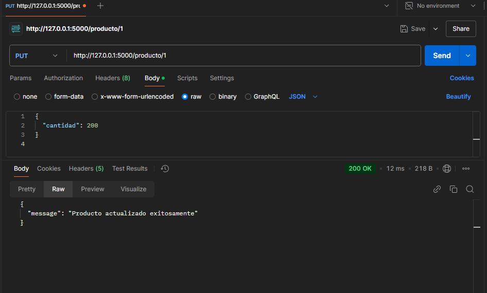
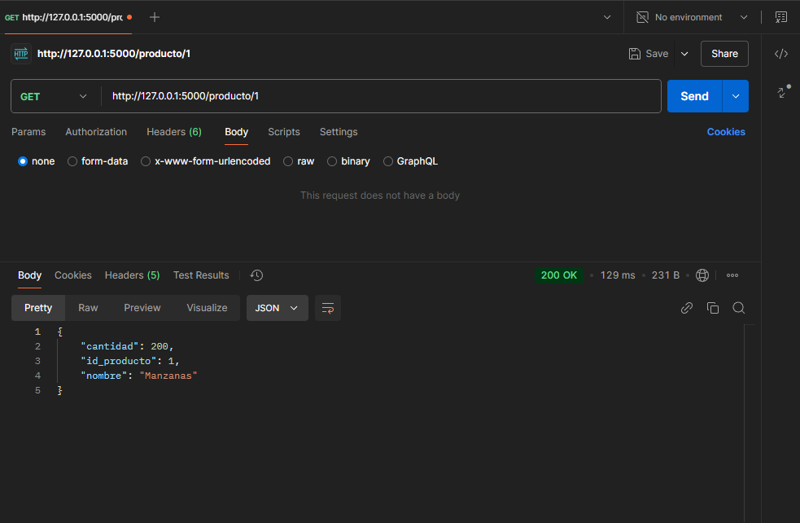
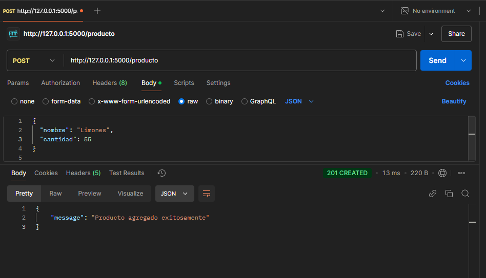
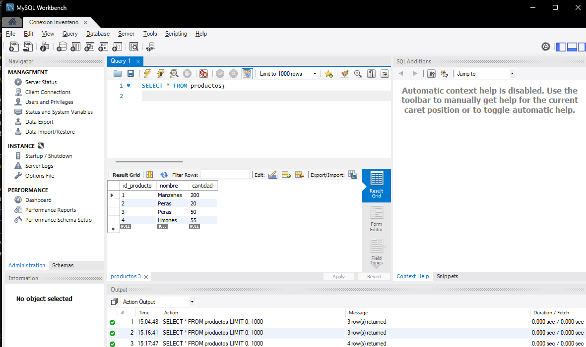

# API de Inventario

## Descripción

Esta API permite gestionar un inventario de productos con operaciones básicas:

- Consultar productos por ID.
- Agregar nuevos productos.
- Actualizar la cantidad de productos existentes.

---

## Requisitos Previos

1. **Base de Datos MySQL**:

   - Asegúrate de tener MySQL instalado y funcionando.
   - Crea una base de datos y tabla siguiendo las instrucciones de configuración.

2. **Python**:

   - Instala Python 3.8 o superior.
   - Instala `pip` y un entorno virtual (`venv`).

3. **Herramientas Opcionales**:
   - Postman para probar la API.
   - Git si deseas clonar el repositorio.

---

## Configuración de la Base de Datos

1. Abre MySQL Workbench o una terminal MySQL y ejecuta los siguientes comandos para crear la base de datos y la tabla:

   ```sql
   CREATE DATABASE inventario_api;
   USE inventario_api;

   CREATE TABLE productos (
       id_producto INT PRIMARY KEY AUTO_INCREMENT,
       nombre VARCHAR(255) NOT NULL,
       cantidad INT NOT NULL
   );
   ```

2. Modifica las credenciales en db_config.py

---

## Ejemplos








